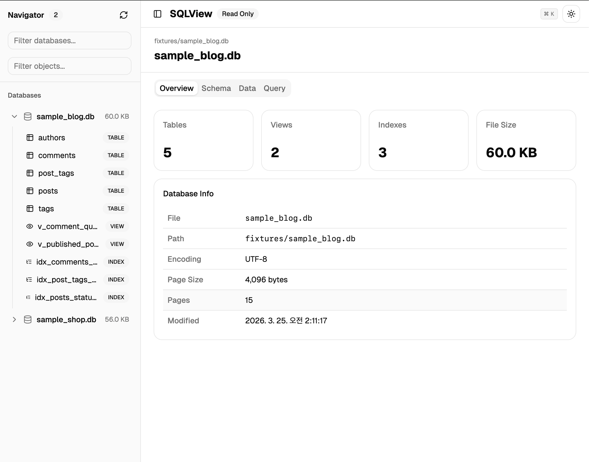
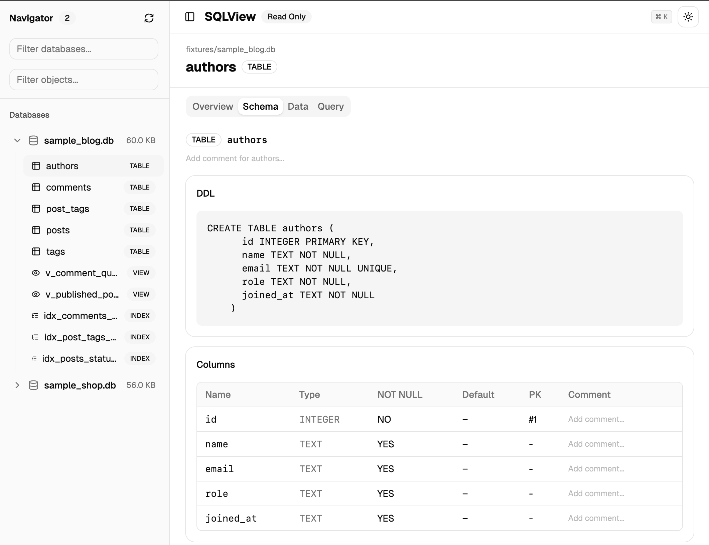
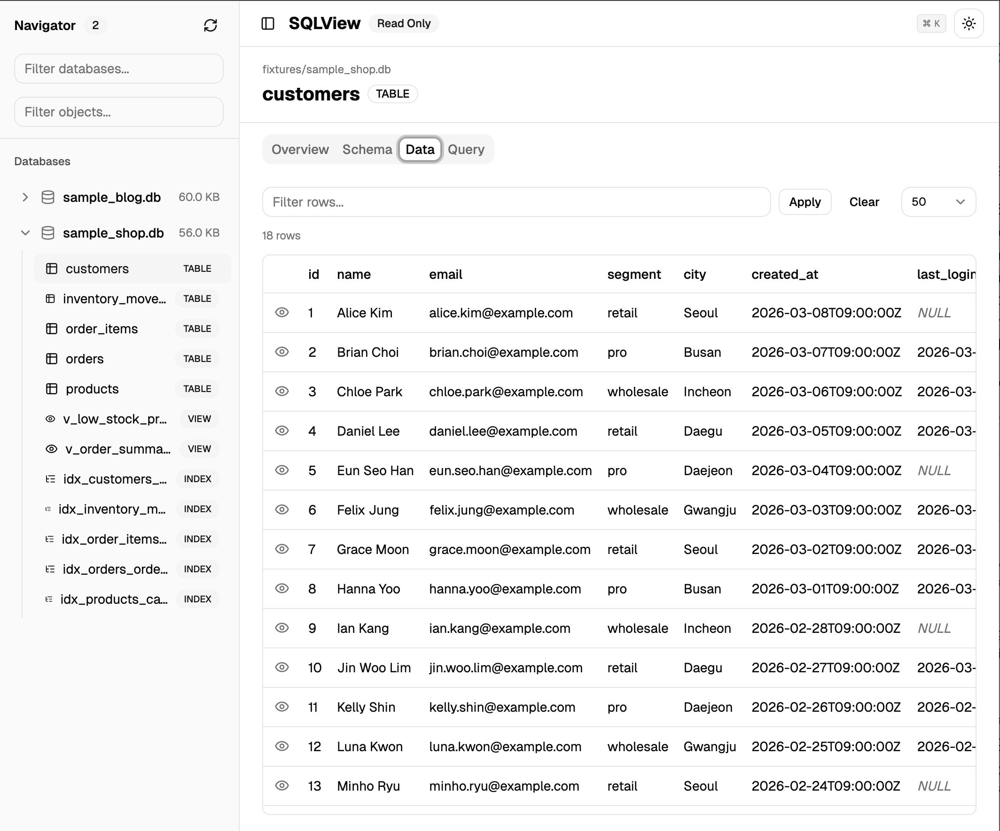

*Read this in other languages: [English](README.md)*

# sqlview

`sqlview`는 터미널 중심 워크플로우를 위한 로컬 읽기 전용 SQLite 브라우저입니다.
`.db` 파일이 있는 디렉터리에서 실행하면 `127.0.0.1`에 웹 UI를 열어 스키마 조회, 테이블 데이터 탐색, 안전한 읽기 전용 쿼리를 실행할 수 있습니다.

## 스크린샷

### 데이터베이스 개요


### 스키마 브라우저


### 데이터 그리드


## 문서
- 기여 가이드: [CLAUDE.md](./CLAUDE.md)

## 프로젝트 목적
이 프로젝트는 터미널 환경에서 개발하는 사용자가 SQLite 데이터베이스를 별도 도구 없이 빠르게 확인할 수 있도록 설계되었습니다.

- 테이블, 뷰, 인덱스, 트리거의 스키마와 DDL을 한눈에 확인
- 컬럼 정렬과 텍스트 필터로 행 데이터를 페이지 단위 탐색
- 안전한 `SELECT`, `WITH`, `EXPLAIN QUERY PLAN` 쿼리 실행
- 로컬 전용(`127.0.0.1`)으로 데이터를 안전하게 유지
- 테이블·컬럼 코멘트를 추가하여 데이터베이스 문서화

기본 스캔 동작:
- 현재 디렉터리(또는 `--root`)에서 `.db` 파일 재귀 탐색
- `.git`, `node_modules`, `dist` 등의 디렉터리는 제외

## 핵심 기능
- 루트 디렉터리에서 `.db` 파일 재귀 탐색
- 데이터베이스 목록, 스키마 브라우저, 데이터 그리드를 제공하는 웹 UI
- SQL 검증을 포함한 읽기 전용 쿼리 러너 (쓰기 키워드 차단)
- `.sqlview/comments.json`에 저장되는 테이블/컬럼 코멘트 시스템
- 포그라운드/백그라운드(데몬) 실행 모드
- `bun build --compile` 기반 단일 실행 파일 빌드

## 요구 사항
- [Bun](https://bun.sh/) 1.2+

`sqlview`는 내장 `bun:sqlite` 모듈을 사용합니다. 외부 런타임 의존성이 없습니다.

## 개발 실행
```bash
bun install
cd frontend && bun install && cd ..
bun src/server.js --foreground --root ./fixtures
```
접속 주소: `http://127.0.0.1:18095`

유용한 옵션:
```bash
# 특정 루트 디렉터리 재귀 스캔
bun src/server.js --foreground --root ./my-databases

# HTTP 포트 변경
bun src/server.js --foreground --port 18096
```

프론트엔드 개발 시 (HMR 지원):
```bash
# 터미널 1: 백엔드
bun src/server.js --foreground --root ./fixtures

# 터미널 2: 프론트엔드 dev 서버 (/api를 백엔드로 프록시)
cd frontend && bun run dev
```

## 빌드
```bash
bun run build
```
출력:
- macOS/Linux: `dist/sqlview`
- Windows: `dist/sqlview.exe`

빌드 스크립트는 프론트엔드(React + Vite)를 컴파일하고, 모든 에셋을 바이너리에 포함시켜 `bun build --compile`로 단일 실행 파일을 생성합니다.

## 설치

### macOS / Linux

1. 빌드 후 원하는 경로에 복사:
```bash
bun run build
mkdir -p "$HOME/bin"
cp dist/sqlview "$HOME/bin/sqlview"
```

2. 설치 경로를 PATH에 추가 (최초 1회):

**zsh** (macOS 기본 쉘):
```bash
echo 'export PATH="$HOME/bin:$PATH"' >> ~/.zshrc
source ~/.zshrc
```

**bash**:
```bash
echo 'export PATH="$HOME/bin:$PATH"' >> ~/.bashrc
source ~/.bashrc
```

3. 확인:
```bash
which sqlview
sqlview --help
```

### Windows

1. 빌드:
```powershell
bun run build
```

2. `dist\sqlview.exe`를 원하는 위치에 복사 (예: `C:\Users\<사용자>\bin\`):
```powershell
mkdir "$env:USERPROFILE\bin" -Force
copy dist\sqlview.exe "$env:USERPROFILE\bin\sqlview.exe"
```

3. 설치 경로를 PATH에 추가:

**PowerShell** (영구, 사용자 수준):
```powershell
$binPath = "$env:USERPROFILE\bin"
$currentPath = [Environment]::GetEnvironmentVariable("Path", "User")
if ($currentPath -notlike "*$binPath*") {
    [Environment]::SetEnvironmentVariable("Path", "$binPath;$currentPath", "User")
}
```
터미널을 재시작하면 적용됩니다.

**CMD** (영구, 사용자 수준):
```cmd
setx PATH "%USERPROFILE%\bin;%PATH%"
```
터미널을 재시작하면 적용됩니다.

4. 확인:
```powershell
where.exe sqlview
sqlview --help
```

## 사용 예시
```bash
# 현재 프로젝트 디렉터리 기준으로 실행
sqlview

# 특정 루트와 포트 지정
sqlview --root ./data --port 18096

# 포그라운드 실행 (데몬 없이)
sqlview --foreground
```

## CLI
```
sqlview [--port <port>] [--root <path>] [--foreground] [--daemon] [--help]
```

| 옵션 | 기본값 | 설명 |
|---|---|---|
| `--root <path>` | 현재 디렉터리 | `.db` 파일을 탐색할 루트 디렉터리 |
| `--port <port>` | `18095` | HTTP 포트 |
| `--foreground` | 꺼짐 | 현재 터미널에서 실행 |
| `--daemon` | 켜짐 | 백그라운드 실행 후 브라우저 자동 열기 |
| `--help` | | 사용법 표시 |

## 보안
- `127.0.0.1`에만 바인딩 (외부 접근 불가)
- 데이터베이스 파일을 `readonly: true`로 열기
- SQL 검증으로 쓰기 키워드 차단 (`INSERT`, `UPDATE`, `DELETE`, `DROP` 등)
- 경로 순회 방어로 루트 외부 접근 차단

## 프로젝트 구조
- `src/`: 서버, SQLite 인스펙터, 경로/쿼리 가드, 파일 인덱서
- `frontend/`: React 19 + Vite + Tailwind CSS 4 + shadcn/ui
- `scripts/`: 빌드 스크립트(`bun build --compile` 패키징), 픽스처 생성기
- `fixtures/`: 개발용 샘플 데이터베이스
- `dist/`: 생성된 빌드 결과물
